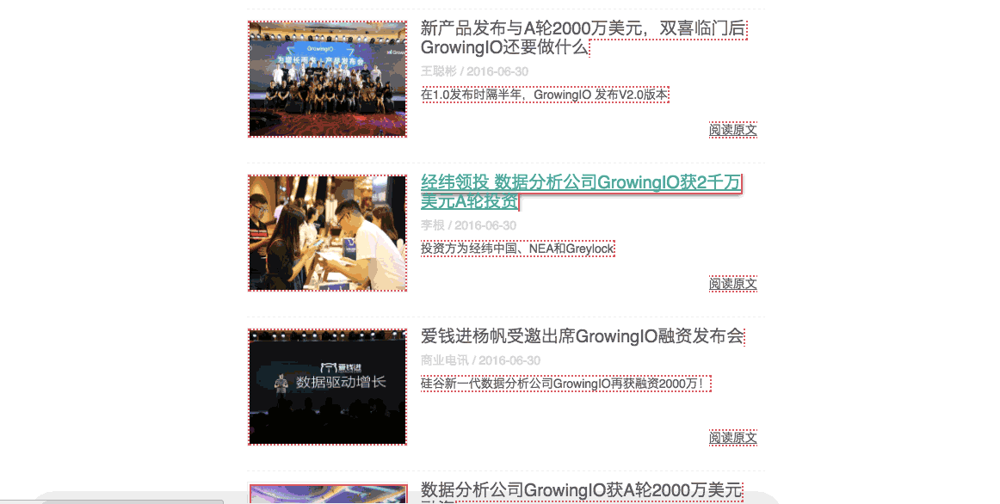
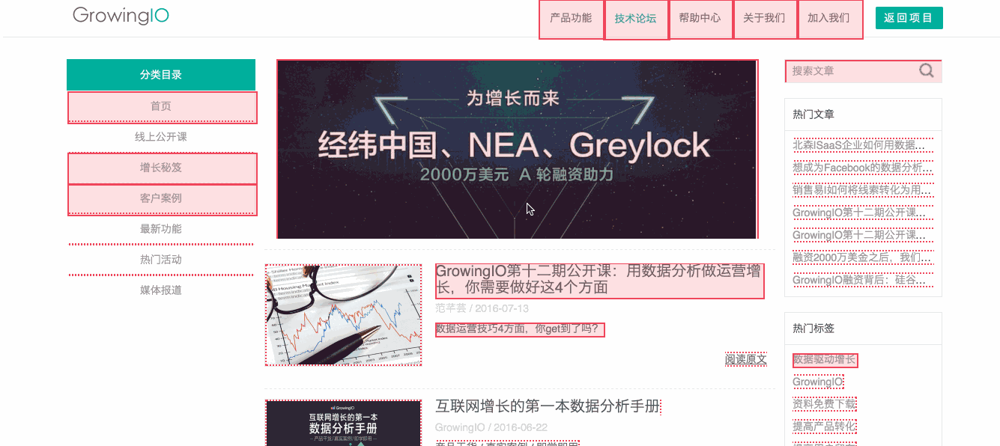
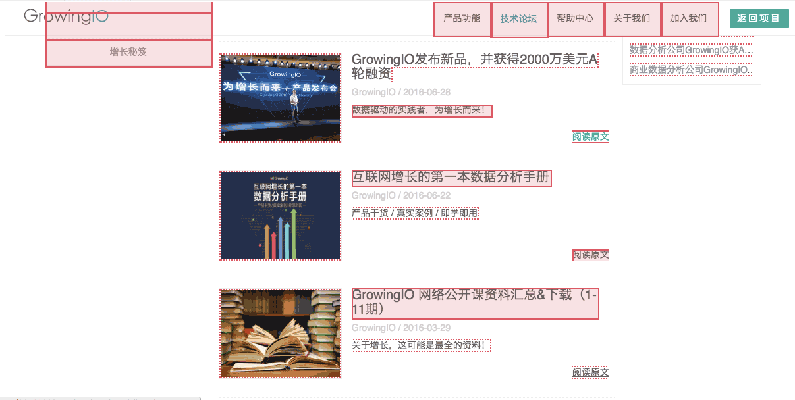
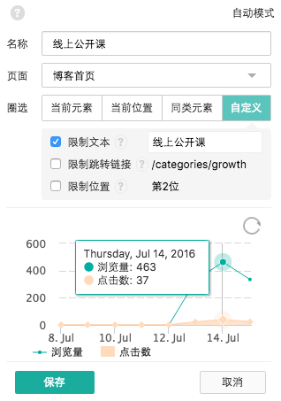

# web圈选（3月21日新版本）

GrowingIO 全量采集用户行为数据，你可以通过「圈选」来定义元素和页面，作为数据分析的基础指标。

在没有定义过的情况下，GrowingIO 保留和回溯元素过去七天的点击量，页面过去七天的浏览量。

通过导航栏进入「圈选」，需要确定你要定义的是元素还是页面，可以在「浏览模式」找到想要分析的元素和页面。


##1.开始圈选

###1.1 定义页面


点击「定义页面」


左侧是选择区，显示的是与当前页面 url 相同的页面，或包含当前页面的页面组。

我们将与当前页面 url 域名和路径相同的页面打上了** [当前页] **的tag，便于查找和识别。如果需要的页面已经被定义过，可以直接使用。

右侧是编辑区，按照页面结构，我们把一个完整的 url 拆解成了：**域名、路径和查询条件**（如有则显示），可以分别编辑。

> <font color="DimGray">**！如何定义一组页面？**

a.「路径」最右侧的开关开启时，可以通过在「路径」中使用「*」来做通配符，达到圈选多个类似页面的目的：

例如，GrowingIO 博客文章内容的地址都是这样的 https://blog.growingio.com/posts/123456 、 https://blog.growingio.com/posts/14562、 https://blog.growingio.com/posts/1264......

那么我们在路径中输入 /posts/* 就会圈选出所有的博客单篇文章的页面。

b.「路径」右侧的开关关闭时，意味着要圈选出所有符合域名为 xxx.xxxxx.com 的一组页面，不管后面的路径是什么。</font>

###1.2 定义元素

在**「圈选」**模式下找到你想要定义的元素。

当一些元素需要鼠标 hover 等交互行为才能显示的时候也可以按住 shift 快捷键，方便地显示出该元素，并且进行圈选。

在右上角我们提供了屏幕尺寸的选项，可以选择不同的设备的屏幕，对自适应元素进行圈选。

圈选导航栏上显示默认开启了**「高亮已定义元素」**，你可以看到哪些元素被定义过，高亮模式下，粉色实线代表已经被圈选的元素，粉色虚线代表已经被圈选的同类元素，点击元素后可以看到最近一次被定义的规则。


进入「圈选」模式，点击一个元素，弹出圈选的弹窗：


**第一步：确认元素所在的页面是什么。**

如果这个元素出现在多个页面同样的位置，想要统计所有的数据，可以通过上面的「定义页面」，先定义元素所在的页面组，再在这里选择该页面组。

**第二步：确定元素统计的规则。**

设置元素当前的文本 / 顺序和跳转链接等限定条件，确定元素统计的规则。

例：这是一个生活服务网站，导航栏中第一个按钮是“美食”，第二个按钮是“健身”，第三个按钮是“生活”，


**例子1**，我们想要统计“生活”这个按钮的点击情况。可能这个按钮会出现在其他位置，比如某个用户所在的城市没有开通健身服务，因此他看到的生活就是出现在第二位的。我们现在想统计“生活”按钮的点击情况，不管它出现在第几位。

操作：
[√]内容为“生活”，[ ]顺序

意义为限定内容为生活，不限定顺序。即统计内容“生活”的按钮的点击量，不管它的位置在第几位。

**例子2**，因为“生活”的点击率很高，想要把它调整到第一位，接下来，我们想要分别统计和对比“生活”这个按钮在第一位和第二位的点击量，变化情况如何。

操作：
a.在“生活”按钮为第一位的时候，限定内容为“生活”，限定顺序为“第一位”，统计“生活”作为第一个按钮时的数据。
b.在“生活”按钮为第二位的时候，限定内容为“生活”，限定顺序为“第二位”，统计“生活”作为第二个按钮时的数据。

这样，我们就可以对比”生活“按钮在不同位置时的点击情况了。

**例子3**，我们想知道导航栏第一位的点击情况，即使以后第一位不是“美食按钮”。

操作：可以选定处于导航栏第一位的元素，只限定位置为第一位，不限定内容。

意思是不管是什么内容，只要处于第一位就都统计进来。

**第三步，在这个过程中，通过动态展示区确认是不是自己想要定义的元素和规则。**


**第四步，保存指标，并使用指标去分析。**

为指标命名，最好包含元素所属页面和限定的条件的信息，保存定义的元素后，就可以去做分析了。如果数据量过大，导致数据还没有回溯完，可以先保存图表，过几分钟再回来看。

在「最近更新列表」中查看刚刚定义过的元素。


##2.FAQ
###2.1 如何定义“一组同类元素之和”？
如果该元素有同类元素，不限定所有的限定条件，即是统计一组同类元素之和的数据。

###2.2 对于已定义过的元素，更改定义规则后，应该如何保存？
更改新的规则后，如果原有数据仍然想继续统计，请选择“另存为”来定义新的规则。

###2.3 如何进行文本“内容”的模糊匹配？
限定“内容”的情况下，将鼠标移动到“内容”的右边，可以看到一个小铅笔，点击小铅笔后，便打开了文本和模式编辑弹窗。默认为精准匹配，即“限定内容为xxx”，若改成模糊匹配，则意义是“限定内容包含xxx”。
保存元素规则后，将按照新的规则进行统计，如果原有数据仍然想继续统计，请选择“另存为”。


###2.4 3月21日迭代后，新旧版本规则对应关系


##web圈选（3月21日之前的版本）

成功加载 SDK 后，GrowingIO 就会自动采集用户的行为数据（采集数据是实时的，但是从采集到展现需要一些时间）。接下来，我们就可以通过圈选定义页面上的元素，包括文字、图片、按钮等，圈选出来的指标是制作任何图表的基础。

1.点击【热图/圈选】后，选择想要圈选的项目，就会进入到相应应用的圈选页面。

2.通过默认的浏览模式进入到想要圈选的页面，点击左上角［圈选］后，就可以开始圈选所需元素了。 
 <font color="red"> 高亮模式下，粉色实线代表已经被圈选的元素，粉色虚线代表已经被圈选的同类元素。</font>

    在圈选模式下按住 shift 键，就可以快速切换至浏览模式，放开 shift 键返回圈选模式。
    当一些元素需要鼠标 hover 等交互行为才能显示的时候也可以使用 shift 快捷键，方便地显示出该元素，并且进行圈选。


3.在右上角我们提供了屏幕尺寸的选项，可以选择不同的设备的屏幕，对自适应元素进行圈选。

<br/>
## <font color="DimGray"> 1.圈选当前页面和元素（web）</font>

<br/>

###1.1定义整页：对整个页面的访问量进行定义

通过点击右上角「定义整页」按钮，在弹出框中 GrowingIO 会根据网页 URL 自动识别出域名、路径等，点击保存即可保存整个页面的访问量（即PV）。


这时也可以通过添加通配符，定义一组页面：

「路径」右侧的开关<font color="red">关闭</font>时，意味着要圈选出所有符合域名为 blog.growingio.com 的一组页面，不管后面的路径是什么；

「路径」最右侧的开关<font color="red">开启</font>时，可以通过在「路径」中使用「<font color="red">*</font>」来做通配符，也能达到圈选多个类似页面的目的：


> <font color="DimGray">例如，GrowingIO 博客文章的地址都是这样的
<br>https://blog.growingio.com/posts/具体路径
<br>
那么我们在路径中输入 /posts/* 就会圈选出所有的博客单篇文章的页面。</font>


###1.2定义某个元素
#####1.2.1 圈选「当前元素」：<font color="red">适用于即使位置改变，依旧统计该元素的场景</font>
应用场景：列表中的文章会经常更新，图中选中的这篇文章在列表中的位置可能发生变化，当只关心这篇文章标题的点击情况，不在乎它出现在文章列表的第几位的时候，可以选择统计当前元素。



#####1.2.2 圈选「当前位置」：<font color="red">适用于某个位置的统计，即使这个位置上的元素改变，依旧统计该位置的数据量</font>
应用场景：经常应用于广告位、搜索结果位的统计。只关心列表中某个位置的点击情况，而不关心出现在该位置的具体内容时，可以选择这个选项。



#####1.2.3 圈选「同类元素」：<font color="red">选择「同类元素」后，绿色高亮的部分都会被一并统计，这里的数据量为同类元素的总量</font>



#####1.2.4 自定义
<p align="center">


</p>
<font color="red">「限制文本」</font>这里会显示被圈选的元素上面的文字。<b>勾选该选项后表示：只统计文本为框中内容“线上公开课”的数据，文本不同将不统计。</b>
<br>
<font color="red">「限制链接」</font> 当所圈的元素为跳转链接时，该链接表示目的页的链接；当所圈元素为图片时，该链接表示图片地址。<b>勾选该选项后表示：只统计与该跳转链接或该图片地址相同的数据，链接不同将不统计。</b>
<br>
<font color="red">「限制位置」</font> <b>勾选该选项后表示：只统计出现在列
表中某个位置的数据，即使该位置内容改变，依旧统计该位置的数据。</b>

<br/>
<h2><font color="DimGray"> 2.圈选跨页面元素（web）</font></h2>
<br/>

在圈选元素的时候，是默认圈选当前页面的，如果想实现跨页面同类元素的圈选，可以在「页面」里选择之前定义过的其它页面。

圈选后的指标在[指标管理](https://docs.growingio.com/Features/circle/tag.html)中可以查看和修改。

<br/>
## <font color="DimGray"> 3.圈选元素的新增文案（web）</font>
<br/>

###3.1 元素标签

元素类型是通过 HTML 标签进行标记的，标签是 HTML 语言中最基本的单位。圈选弹出框里会告诉用户圈到的元素类型。

具体可能圈选到的标签可以参考：https://developer.mozilla.org/zh-CN/docs/Web/HTML/Element

###3.2 圈选到容器的情况

我们认为的“容器”是嵌套了一个或多个最底层元素的元素。当所圈选的元素是一个有嵌套关系的容器时，为了方便您的圈选，我们对这些最底层元素也同时做了高亮处理，高亮的元素都是支持圈选的。

我们对于容器关系的元素圈选，容器内的元素点击数计算会有以下两种情况：
1. 当前选中容器是类型为 A 的超链接元素，该超链接元素的点击数包含其嵌套区域内部所有元素的点击数总和。
2. 在其他情况下，容器本身的点击数不包含内部所嵌套其他元素的点击数。如果需要整个容器内的点击数总和，请分别圈选该容器内部的各个元素后使用合并简单指标进行计算点击数。

<br/>
## <font color="DimGray"> 4.不能圈选的可能原因以及对应方法（web）</font>
<br/>

###4.1 不能圈选的原因

不能圈选的原因包含了，但不仅限于：
1. 元素包含属性：data-growing-ignore， 因此不可以被圈选。如果需要圈选该元素，请去除该属性。
2. 密码框不支持被圈选。
3. 元素已经被圈选，因此不能被重复圈选。
4. 元素是叶子节点，无文本内容，且元素的占屏幕面积超过50%，因此不能被圈选。如果需要圈选该元素，请添加data-growing-circle属性。
5. 元素所在的Dom嵌套层数过多，不在倒数后两层；或者层数符合但是没有实际内容，因此不能被圈选。

###4.2 data-growing-circle属性的使用帮助：

元素是叶子节点，无文本内容，且元素的占屏幕面积超过50%，因此不能被圈选。如果需要圈选该元素，请添加data-growing-circle属性。例如 ：
```groovy
 <div id= "d1" style="border: 1px solid black; width: 80%; height: 80%"></div>
```

本来不可以圈选。在添加data-growing-circle 属性后，既可以圈选：
```groovy
<div  id= "d1" style="border: 1px solid black; width: 80%; height: 80%" data-growing-circle></div>
```

<br/>

##常见问题（web）

### 1.如果我的页面改版，现在标记的指标是不是需要重新定义？
改版后，变化的元素需要重新圈选。

### 2.什么时候选择手动圈选，什么时候选择自动圈选？

使用自动模式可以很方便快捷地圈选某些元素。但是有些时候由于页面框架的实现方式，自动圈选会圈选相似的模块进来，从而造成数据误差，所以必要时可以切换手动圈选来解决问题。

### 3.H5怎么圈选？
GrowingIO 可以统计原生应用中的 H5 页面和 H5 做成的应用。
* 
原生应用中的H5页面，以及嵌在应用中的h5，
请参考[iOS/Android圈选指南](https://docs.growingio.com/Features/circle/iOSorAndroid.html)
* 
用H5做的应用请参考[web圈选指南](https://docs.growingio.com/Features/circle/Web.html)

### 4.为什么圈选的元素只有点击量，没有浏览量？
1. 如果被圈选元素是 a, button, input，img，并且在倒数两层以下，只统计点击量，不统计浏览量。
2. 如果用户使用的是 IE8 及以下的 IE 浏览器版本，无法统计浏览量 ，只统计点击量。

### 5.为什么圈选的元素只有浏览量，没有点击量？
1. 可能真的是没有点击量。
2. 可能选中的是纯文本等没有带超链接可点击的元素。

### 6.当页面带查询条件的时候，开关查询条件，数据为什么没有变化？
当圈选元素所在的页面带查询条件的时候，此时圈选框内展示的数据是不带查询条件的数据。保存带查询条件指标后，指标不会回溯数据，会从保存后开始统计数据。

### 7.web 圈选时候页面加载不完全？错位？
部分浏览器会有兼容性问题，推荐使用 Chrome 浏览器。

### 8.web 端已经装了 SDK，现在不能进行圈选。
1. 有可能是工程师没有成功加载 JS；
2. 可能是该网站禁止了 iframe 的加载，请联系工程师修改配置；
3. 可能是工程师加载 js 代码时的项目 ID 填写有误（项目 ID 没有空格）；
4. 有可能复写 window 对象：可视化圈选时候，必须要保证您的网站与  GrowingIO 平台之间的通信。如果 window.top, window.parent, window.name, window.location 被复写，将导致无法圈选。

### 9.能否在 iframe 中进行圈选？  
如果 iFrame 中的内容集成了 GrowingIO 的代码就可以圈选，否则无法圈选。
GrowingIO 是使用 iframe 来加载目标网页进行可视化定义的。如果目标网站禁止了 iframe 加载，就无法正常定义标签，当点击某个按钮的时候，页面无法发生跳转且命令行显示：

    Refused to display '**' in a frame because it set 'X-Frame-Options' to 'SAMEORIGIN'.

此时只允许同个顶级域名加载，因此需要设置运行 iframe 加载，如果您的网站使用 https 协议，需将配置修改成：

    X-Frame-Options: Allow-From https://www.growingio.com 
### 10.在web圈选的时候，为什么有时候会一下圈出一组同类元素，有办法区分开么？**

GrowingIO根据您网站HTML结构识别和定义页面上的元素。有的时候网站上的HTML标签写法完全相同，呈现在页面上的几个同类元素，可能HTML代码完全相同。此时GrowingIO采集、圈选数据时无法区分开。我们通过HTML标签的id和class来区分元素，这种情况下您可以在需要区分的标签class中添加一些字符串用于区分。

**仍有疑问？请参考[常见问题－圈选部分](https://docs.growingio.com/FAQ/terms.html)**   
