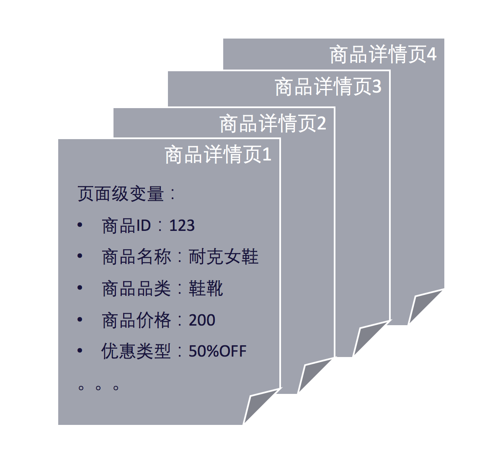
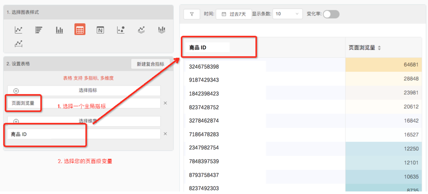

# 页面级变量

**定义：页面级变量继承自原页面属性（PS字段），此变量与页面绑定，可作为维度分解页面浏览量及页面上发生的无埋点指标。**

## **页面级变量的持久性范围**

页面级变量的持久性范围仅在当前页面内，随着用户操作行为导致页面一旦变化，保存在页面级变量中的值就宣告失效。也就是说，页面级变量作为维度，只能用于分解它们标记的页面（如上述的商品详情页和频道页）的无埋点指标，不能用于分解本页面的埋点指标或任何其他页面上指标。

## **页面级变量使用的场景**

页面级变量可以用于下述场景

* 各个不同板块页面的用户访问情况分析。在这种场景下，使用一个页面级变量保存页面所属板块的名称。
* 各个不同子站点的用户访问情况分析。在这种场景下，使用一个页面级变量保存页面所属子站点的名称。
* 各个不同类型页面的用户访问情况分析。在这种场景下，使用一个页面级变量保存页面所属的类型名称。例如功能引导页面，购物流程页面等。

### 分析场景示例一

常用于商品详情页、搜索结果页等由同一个模板\(类\)填充的多个页面，以便区分这些页面间不同的业务含义。例如商品详情页可用页面级变量来标记：商品名称、商品ID、品类、价格等信息。如图示：

在按上图所示，为所有商品详情页打上页面级变量的标签后，在GrowingIO后台，上述5个页面级变量均会成为“维度”，可在各分析图表、工具中选用。例如在单图中，即可按商品ID来分解页面浏览量：

### 分析场景示例二

例如，在某门户网站里存在多个频道（新闻、娱乐等），用户可能会浏览新闻类页面，也可能会浏览娱乐类页面，那么在这样的场景下，GrowingIO推荐设置一个页面级变量来保存页面的类型信息，然后使用类似于下面代码来将这样的页面类型的信息保存在一个页面级变量中。我们为所有的新闻类页面调用下述代码，为它们打上“频道=新闻”这样一个标签，然后在GrowingIO后台即可按频道来分解用户的浏览行为。

* 网站代码

gio\(“page.set”, “channel”, “新闻”\);

* Android代码

GrowingIO.setPageVariable\(Activity activity, ”channel”, “新闻”\);

* iOS代码

\[Growing setPageVariableWithKey:@"channel" andStringValue:@"新闻" toViewController:myViewController\];

