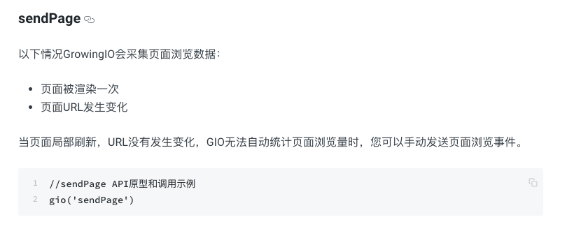

# iOS SDK 安装

如果您的 iOS 项目中集成了 Firebase SDK，请确保使用的 Firebase SDK 版本在 4.8.1 及以上，并且集成 GrowingIO SDK 2.1.1 及以上版本，否则会造成数据采集不到的情况。

## 1. 选择 SDK 安装方式 {#1-选择-sdk-安装方式}

请确保您的 XCode 版本为 7.3 或者其后的版本。

GrowingIO 支持两种 iOS SDK 安装方式：

一. 使用 CocoaPods 管理依赖

1. 添加`pod 'GrowingIO', '~>2.3.3'`到 Podfile 中
2. 执行`pod update`，不要用`--no-repo-update`选项
3. 直接进入安装文档的第四步

二. 手动安装依赖

1. 下载 [2.3.3](http://assets.growingio.com/sdk/GrowingIO-iOS-SDK-2.3.3.zip) 版 iOS SDK
2. 进行安装文档的第二步

## 2. 导入 SDK

按照以下步骤将SDK导入到您的项目中：

1. 解压 iOS SDK 压缩文件
2. 将 Growing.h 和 libGrowing.a 添加到 iOS 工程


#### 提醒:

* 记得勾选 "Copy items if needed"

## 3. 添加依赖

在工程项目中添加以下库文件

| 库名称 | 说明 |
| :--- | :--- |
| Foundation.framework | 基础依赖库 |
| Security.framework | 用于APP连接圈选页面SSL连接 |
| CoreTelephony.framework | 用于读取运营商名称 |
| SystemConfiguration.framework | 用于判断网络状态 |
| AdSupport.framework | 用于来源管理激活匹配 |
| libicucore.tbd | 用于APP连接圈选页面解析 |
| libsqlite3.tbd | 存储日志 |
| CoreLocation.framework | 用于读取地理位置信息（如果您的app有权限） |

**添加完成以后，库的引用如下:**

**提醒：**

* 添加项目依赖库的位置在项目设置target -&gt; 选项卡General -&gt; Linked Frameworks and Libraries

## 4. 添加编译参数 {#4-添加编译参数}


## 5. 设置 URL Scheme {#4-添加编译参数}

**（1）获取URL Scheme**

* 添加新产品：登录官网 -&gt; 点击项目选择框 -&gt; 点击“项目管理” -&gt; 点击“应用管理” -&gt; 点击“新建应用”-&gt;选择添加 iOS 应用 -&gt; 填写“应用名称“，点击下一步 -&gt;在第二段中标黄字体。
* 现有产品：登录官网 -&gt; 点击项目选择框 -&gt; 点击“项目管理” -&gt; 点击“应用管理” -&gt; 找到对应产品的 URL Scheme



**（2）添加 URL Scheme（growing.xxxxxxxxxxxxxxxx）到项目中，以便唤醒您的程序进行圈选**

**（3）在 AppDelegate 中添加激活圈选的代码**

```text
- (BOOL)application:(UIApplication *)application openURL:(NSURL *)url sourceApplication:(NSString *)sourceApplication annotation:(id)annotation
{
    if ([Growing handleUrl:url])
    {
        return YES;
    }
    ...
    return NO;
}
```

提醒：

* 如果您的 AppDelegate 中，实现了其中一个或者多个方法，请在已实现的函数中，调用`[Growing handleUrl:]`:

```text
- (BOOL)application:(UIApplication *)application openURL:(NSURL *)url sourceApplication:(nullable NSString *)sourceApplication annotation:(id)annotation
- (BOOL)application:(UIApplication *)application handleOpenURL:(NSURL *)url
- (BOOL)application:(UIApplication *)app openURL:(NSURL *)url options:(NSDictionary<NSString*, id> *)options
```

* 如果以上所有函数都未实现，则请实现以下方法并调用`[Growing handleUrl:]`:

```text
- (BOOL)application:(UIApplication *)application openURL:(NSURL *)url sourceApplication:(nullable NSString *)sourceApplication annotation:(id)annotation
```

* 实际情况可能很复杂，请在调试时确保函数`[Growing handleUrl:]`会被执行到

## 6. 添加初始化函数 {#5-添加初始化函数}

在 AppDelegate 中引入`#import "Growing.h"`并添加启动方法

```text
#import "Growing.h"

- (BOOL)application:(UIApplication *)application
    didFinishLaunchingWithOptions:(NSDictionary *)launchOptions {
      ...
      // 启动GrowingIO
      [Growing startWithAccountId:@"xxxxxxxxxxxxxxxx"]; //替换为您的ID
      // 其他配置
      // 开启Growing调试日志 可以开启日志
      // [Growing setEnableLog:YES];
  }
```

_**请确保将代码添加在上面描述的位置，添加到其他函数中或者异步 block 中可能导致数据不准确！**_

## 7. 重要配置项 {#7-重要配置项}

### 7.1 设置界面元素ID {#设置界面元素id}

当您的应用界面改版时，可能会导致无法准确地统计已经圈选的元素。因此，对于应用中的主要流程涉及到的界面元素，建议您为它们设置固定的唯一ID，以保证数据的一致性。

具体要求：

* 主要流程指的是登录、注册、购买、发帖等操作步骤。
* 设置ID的对象是界面的重要按钮等元素，如“注册”、“结算”、“发布”按钮。

设置ID的方法如下：

（1）接口

```text
@interface UIView(GrowingAttributes)
@property (nonatomic, copy)NSString *growingAttributesUniqueTag;
@end
```

（2）代码写法：请加在viewWillAppear或者时机更早的函数里。

```text
-(void)viewWillAppear
{
    UIView *MyView;
    …
    MyView.growingAttributesUniqueTag = @"my_view”;
}
```

（3）ID只能设置为字母、数字和下划线的组合。

（4）对于已经集成过旧版SDK并圈选过的应用，对某个元素设置ID后再圈选它，指标数值会从零开始计算，类似初次集成SDK后发版的效果，但不影响之前圈选的其它指标数据。如果不希望出现这种情况，请不要使用这个方法。

### 7.2 采集广告Banner数据 {#采集广告banner数据}

很多应用上方都有横向滚动的Banner广告。对于这样的广告，如果要收集数据，请在响应点击的控件上添加如下代码

```text
UIView *view;
…
view.growingAttributesValue = 广告的唯一ID;
```

其中view是您的广告元素，请确保两点：

* 对不同广告图，广告的唯一ID也不相同
* 响应点击的控件，与设置ID的控件是同一个

例如，当您的横向滚动广告共有3张广告图时，您可以在3个响应点击的View上分别设置不同的广告唯一ID，类似如下效果：

```text
view1.growingAttributesValue = @“ad1”;
view2.growingAttributesValue = @“ad2”;
view3.growingAttributesValue = @“ad3”;
```

此外，当您想采集一些可能没有文字的控件（比如UIImageView，UIView）时，也可以给属性growingAttributesValue赋值作为文字，用来在圈选的时候区分不同的内容。

### 7.3 采集输入框数据 {#采集输入框数据}

如果您需要采集应用内某个输入框内的文字（例如搜索框），请调用如下接口进行设置

`UIView *view; // view可以是UITextField, UITextView, UISearchBar ...`

`view.growingAttributesDonotTrackValue = NO;`

其中，view代表要被采集的输入框。 当这个输入框失去焦点（包括应用退到后台），且输入框内容跟获取焦点前相比发生变化时，输入框内文字会被发送回GrowingIO。 请注意：对于密码输入框，即便标记为需要采集，SDK也会忽略，不采集它的数据。

### 7.4 Facebook广告SDK {#facebook广告sdk}

如果使用了Facebook广告SDK，请务必添加以下代码来避免冲突，否则可能造成无法创建项目或者统计准确性问题。

请在main函数第一行调用下方函数。APP启动后，将不允许修改采集模式。

`[Growing setAspectMode:GrowingAspectModeDynamicSwizzling]`

### 7.5 采集H5页面数据 {#采集h5页面数据}

会自动采集H5页面的数据，不需要特殊配置。

### 7.6 采集GPS数据 {#采集gps数据}

如果您的应用有相应权限，我们将自动采集您的GPS数据。

### 7.7 启用Hashtag识别

添加以下方法以启用Hashtag识别：

```text
    // 设置为 YES, 将启用 HashTag
    + (void)enableHybridHashTag:(BOOL)enable;
```

## 8. 在 App Store 提交你的应用

集成了 GrowingIO SDK 以后，默认会启用 IDFA，所以在向 App Store 提交应用时，需要：

* 对于问题 **Does this app use the Advertising Identifier \(IDFA\)**，选择 YES。
* 对于选项**Attribute this app installation to a previously served advertisement**，打勾。
* 对于选项**Attribute an action taken within this app to a previously served advertisement**，打勾。

> **为什么 GrowingIO 使用 IDFA?**
>
> GrowingIO 使用 IDFA 来做来源管理激活设备的精确匹配，让你更好的衡量广告效果。如果你不希望跟踪这个信息，可以选择不引入 AdSupport.framework 或者在用 Cocoapods 安装时使用 ‘GrowingIO/without-IDFA' subspec.

至此，您的SDK安装就成功了。登录 GrowingIO 进入产品安装页面执行“数据检测”，几分钟后就可以看到数据了。

**其他设置（如设置“登录用户ID”）请前往** [**iOS SDK API中查看**](ios-sdk-api.md)**。**

